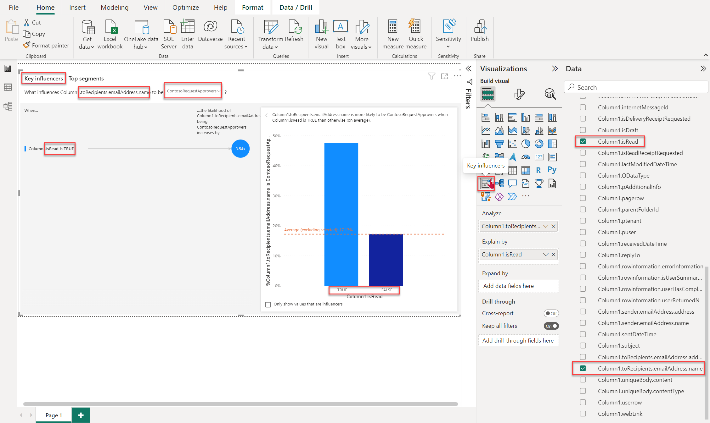

## Visualize your Microsoft Graph Data Connect data in Microsoft Power BI

This exercise describes how to create a report in Microsoft Power BI to visualize your Microsoft 365 data from Microsoft Graph Data Connect.

As a pre-requisite, you need to complete the steps in this tutorial. Once you have your JSON file in your Azure Storage, complete the following steps:

1. Open your Power BI desktop application or download it from: [Download Power BI tools and apps](https://powerbi.microsoft.com/en-us/downloads/)  

2. Click on the **Get Data** window, select **Azure** and choose **Azure Blob Storage** from the list of Azure services.

3. Click **Connect** to establish the connection between Power BI and your Azure Blob Storage account.

4. Add the Azure Blob Storage **Account name or URL**: Enter the Azure Storage Account name and container name for the Azure Blob Storage account you want to connect to, then click **OK**.

> **Note:** You can find your Azure Storage URL in the Azure Storage Account. Navigate to your containers and choose the container you want to connect, click on the Context menu (...), select **Container properties**, and copy the URL.

5. Select **Transform Data** and click to go inside the first line that says **Binary**.

6. Get a list with all the **Records**: On the Column1 toggle option, right click to select **Transform**, then choose **JSON**.

7. Load all the columns: Expand the **Records** from the Column1 toggle, then click **OK**.

6. The results are shown as _Column1.property_. You can now expand again the columns with nested data by clicking on the toggle option on each column, then click **OK**.

    - You can now click on **Close & Apply** and wait for your query to load all the columns.

    

7. Once it loaded all the columns, you can now build visuals with your data.

    - Under **Data**, select **Query1** to expand the columns and choose the properties you want to visualize.
    - Under **Visualizations**, select the **Key Influencers** option to visualize the data.
    
> **Note:** In this example, you can easily see if users read the messages sent by a department in your organization, by analyzing every "toRecipientName" and the property "isRead".

8. You can now see the JSON data from the Messages_v1 data set from Microsoft Graph Data Connect in a Power BI report.

> [!NOTE]
> You can choose the desired data connectivity mode (**DirectQuery** or **Import**) depending on your data size and query requirements. We recommend that you use **DirectQuery** in this tutorial.

## See also
- [Find solution templates using Microsoft Graph Data Connect built in Power BI.](https://github.com/microsoftgraph/dataconnect-solutions/tree/main/solutions)
